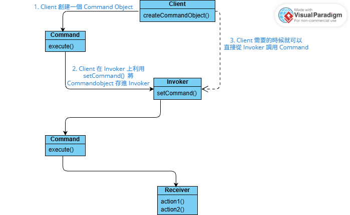

## 命令模式 Command Pattern 

> 將「要做的行為」封裝成一個 Object 
{: .prompt-tip }

## Main Idea 


將 operation 封裝成 object, 使得 Invoker & Receiver 不需要 coupling relation，並且這麼做能使得一個 operation 可以被儲存、延遲執行、排程、甚至 undo ~ 

## Simple Example 
```cpp
// Abstract command interface 
class Command {
public: 
    virtual void Execute() = 0;
    virtual ~Command() = default; 
}; 

// Concrete command interface (Turn on the light)
class Light {
public: 
    void TurnOn() { std::cout << "Light on!"; }
};

class TurnOnLightCommand: public Command {
public: 
    // 加上 explicit 避免隱式轉換（Constructor 如果只有一個參數通常可以考慮先加！）
    explicit TurnOnLightCommand(Light* light): light_(light){}
    void Execute() override {
        light_->TurnOn();
    }
private: 
    Light* light_;
};

// Invoker (Remote controller)
class RemoteController {
public: 
    void SetCommand(Command* cmd) { command_ = cmd; }
    void PressButton() { command_->Execute(); }
private: 
    Command* command_; 
};

int main() {
    Light light; 
    TurnOnLightCommand cmd(&light);

    RemoteController remote;
    remote.SetCommand(&cmd);
    remote.PressButton(); // Print: "Light on!" 
}
```

## Utilize no command 
具例來說，一個 remote controller 可能會有一些尚未設定對應功能的按鍵，這個時候可以利用 NoCommand object (Do nothing) 做為 default command ，避免呼叫 execute 時出現未知的問題~

```cpp
// 加上 final, 因為 NoCommand 不會再需要被繼承了
class NoCommand final : public Command {
public: 
    void Execute() override {}
};
```

## Undo
可以在 Command class 中加上 Undo 的概念！
通常會利用 history stack 來維護 undo 的順序，或者有的會限制只能 undo 一次

```cpp
class Fan {
public:
    enum class Speed {
        kOff,
        kLow,
        kMedium,
        kHigh
    };
    void SetSpeed(Speed speed) { speed_ = speed; }
    Speed GetSpeed() const { return speed_; }
private:
    Speed speed_ = Speed::kOff;
};

class SetFanSpeedCommand: public Command {
public: 
    SetFanSpeedCommand(Fan* fan, Fan::Speed speed): 
        fan_(fan), speed_(speed) {}
    
    void Execute() override {
        previous_speed_ = fan_->GetSpeed();
        fan_->SetSpeed(speed_);
    }
    void Undo() override {
        fan_->SetSpeed(previous_speed_);
    }
private: 
    Fan* fan_;
    Fan::Speed speed_;
    Fan::Speed previous_speed_;
};

class RemoteController {
public:
    void SetLow(Command* cmd) { low_ = cmd; }
    void SetHigh(Command* cmd) { high_ = cmd; }
    void Low() { low_->Execute(); history_.push(low_); }
    void High() { high_->Execute(); history_.push(high_); }
    void Undo() {
        if (history_.empty()) return;
        history_.top()->Undo();
        history_.pop();
    }
private:
    Command* low_;
    Command* high_;
    std::stack<Command*> history_;
};

int main() {
    Fan fan;
    SetFanSpeedCommand low(&fan, Fan::Speed::kLow);
    SetFanSpeedCommand high(&fan, Fan::Speed::kHigh);

    RemoteController remote;
    remote.SetLow(&low);
    remote.SetHigh(&high);

    remote.Low();     // Off -> Low
    remote.High();    // Low -> High
    remote.Undo();    // High -> Low
    remote.Undo();    // Low -> Off
}
```

## Macro Command 
Macro command 自己本身也是一個 command class, 只是可以同時打包多個 commands 變成一個 command 一次執行，注意到當 Macro command undo 時，他的所有 commands 需要倒序 undo！

```cpp
class MacroCommand : public Command {
public:
    explicit MacroCommand(std::vector<Command*> commands)
        : commands_(std::move(commands)) {}

    void Execute() override {
        for (auto* command : commands_)
            command->Execute();
    }
    void Undo() override {
        for (auto it = commands_.rbegin(); it != commands_.rend(); ++it)
            (*it)->Undo();
    }
private:
    std::vector<Command*> commands_;
};
```

## 小記
書中也有提到 Command pattern 透過將每個 operation 封裝成獨立的 command object, 降低跟 task runner 之間的 coupling relation。Task runner 不需要知道 operation 的具體內容，只需要決定執行的時機點及順序。
